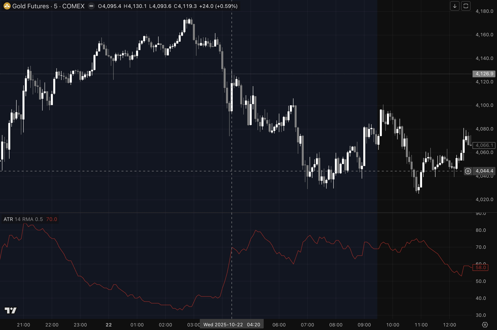
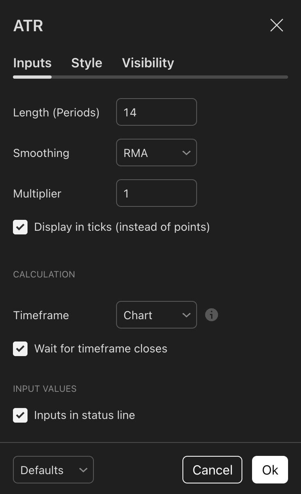

# Averate True Range In Ticks — TradingView Indicator

A powerful TradingView Pine Script indicator that displays the Average True Range (ATR) converted to ticks, making it
easier to set your stop loss (SL) and take profit (TP) across different instruments.

<figure>
    
    <figcaption>ATR in ticks for $GC, with a 0.5x multiplier on the M5 timeframe.</figcaption>
</figure>

## Features

### Core Functionality

- **Tick Conversion:** Automatically converts ATR from price points to ticks (minimum price increments)
- **Multiple Smoothing Options:** Choose from 4 different moving average types:
  - RMA (Relative Moving Average)
  - SMA (Simple Moving Average)
  - EMA (Exponential Moving Average)
  - WMA (Weighted Moving Average)
- **ATR Multiplier:** Apply a multiplier to scale the ATR value (e.g., 2x ATR for wider stops)
- **Multi-Timeframe Support:** View ATR from higher timeframes while on lower timeframe charts

### Why Ticks Matter

Displaying ATR in ticks normalizes volatility measurements across different instruments, making it particularly useful
for:

- Setting consistent stop losses based on market volatility
- Calculating position sizing
- Comparing volatility across different markets (forex, futures, stocks, crypto)

## Development

1. Open TradingView
2. Navigate to Pine Editor (bottom of screen)
3. Click "Create new" and select "Indicator"
4. Copy the entire code from `atr-ticks-multiplier.pine`
5. Click "Save" and give it a name
6. Click "Add to Chart"

## Parameters



### Basic Settings

| Parameter            | Default | Description                                      |
| -------------------- | ------- | ------------------------------------------------ |
| **Length (Periods)** | 14      | Lookback period for ATR calculation              |
| **Smoothing**        | RMA     | Moving average type for smoothing                |
| **Multiplier**       | 1.0     | Multiply ATR by this value (min: 0.1, step: 0.1) |
| **Display in ticks** | _ON_    | Convert output to ticks instead of price points  |

### Advanced Settings (CALCULATION group)

| Parameter                     | Default | Description                                                |
| ----------------------------- | ------- | ---------------------------------------------------------- |
| **Timeframe**                 | Chart   | Multi-timeframe analysis - view ATR from higher timeframes |
| **Wait for timeframe closes** | _ON_    | Wait for higher timeframe candles to close before updating |

## Usage Examples

### Example 1: Stop Loss Placement

For setting your SL when trading on the M5 timeframe.

```
Given your ATR is showing 50 ticks (1.0x multiplier), here are some SL options.

Conservative SL (1.5x to 2.0x):  75 to 100 ticks
Standard SL     (1.0x to 1.5x):  50 to  75 ticks
Tight SL        (0.5x to 1.0x):  25 to  50 ticks
```

Set the multiplier to `0.5` or `2.0` for example to automatically calculate 0.5x or 2x ATR values for your stop losses.

### Example 2: Multi-Timeframe Analysis

```
Chart Timeframe: 5 minutes
Indicator Timeframe: 60 minutes (1 hour)
```

View the hourly ATR on a 5-minute chart to understand volatility from a broader perspective.

### Example 3: Different Smoothing Types

- **RMA:** Standard ATR, slower to react to volatility changes
- **EMA:** More responsive to recent price action
- **SMA:** Simple average, no weighting
- **WMA:** Emphasizes recent data more than SMA but less than EMA

## Technical Details

- **Pine Script Version:** 6
- **Indicator Type:** Oscillator (separate pane)
- **License:** Mozilla Public License 2.0
- **Author:** @waldoibarra

### How It Works

1. Calculates true range using `ta.tr(true)`
2. Applies selected moving average smoothing to true range
3. Converts result from price points to ticks by dividing by `syminfo.mintick`
4. Applies optional multiplier
5. Displays final value as a red line plot

### Multi-Timeframe Calculation

When using a higher timeframe:

- `barmerge.gaps_on` (default): Shows gaps between higher timeframe candle closes
- `barmerge.gaps_off`: Fills gaps with previous values for continuous display

## Common Use Cases

### Day Trading

- **Settings:** 14 periods, RMA, 1.5x multiplier, chart timeframe
- **Purpose:** Set intraday stop losses based on current volatility

### Swing Trading

- **Settings:** 14 periods, RMA, 2.0x multiplier, daily timeframe on H4 chart
- **Purpose:** Set wider stops based on daily volatility while analyzing H4 entries

### Scalping

- **Settings:** 7 periods, EMA, 1.0x multiplier, chart timeframe
- **Purpose:** Quick-reacting ATR for fast market conditions

### Position Trading

- **Settings:** 20 periods, RMA, 3.0x multiplier, weekly timeframe
- **Purpose:** Set very wide stops for long-term positions

## Tips & Best Practices

1. **Tick display:** Keep "Display in ticks" _ON_ for consistent measurements across instruments
2. **Multiplier usage:** Common values are 0.5x, 1x, 1.5x, 2x, or 3x depending on your risk tolerance
3. **Smoothing selection:**
   - Use RMA for standard ATR behavior
   - Use EMA when you need faster reaction to volatility changes
4. **Timeframe selection:**
   - Use chart timeframe for entries based on current volatility
   - Use higher timeframes for broader market context
5. **Wait for closes:** Keep it _ON_ to avoid repainting when using higher timeframes

## Troubleshooting

**Q: Why are my values different from the built-in ATR?**

A: This indicator displays in TICKS by default. Disable "Display in ticks" to match the built-in ATR values in price
points.

**Q: Why does the indicator show gaps?**

A: You're using a higher timeframe with "Wait for timeframe closes" enabled. This is normal, gaps appear between
candle closes on the higher timeframe.

**Q: Can I use this for all markets?**

A: Yes! The tick conversion makes it universally applicable across forex, futures, stocks, and crypto.

## Contributing

Contributions are welcome! If you find bugs or have feature requests, please open an issue.

## License

This Pine Script code is subject to the terms of the [Mozilla Public License 2.0](https://mozilla.org/MPL/2.0/).

## Acknowledgments

Built with Pine Script v6 for the TradingView platform.
